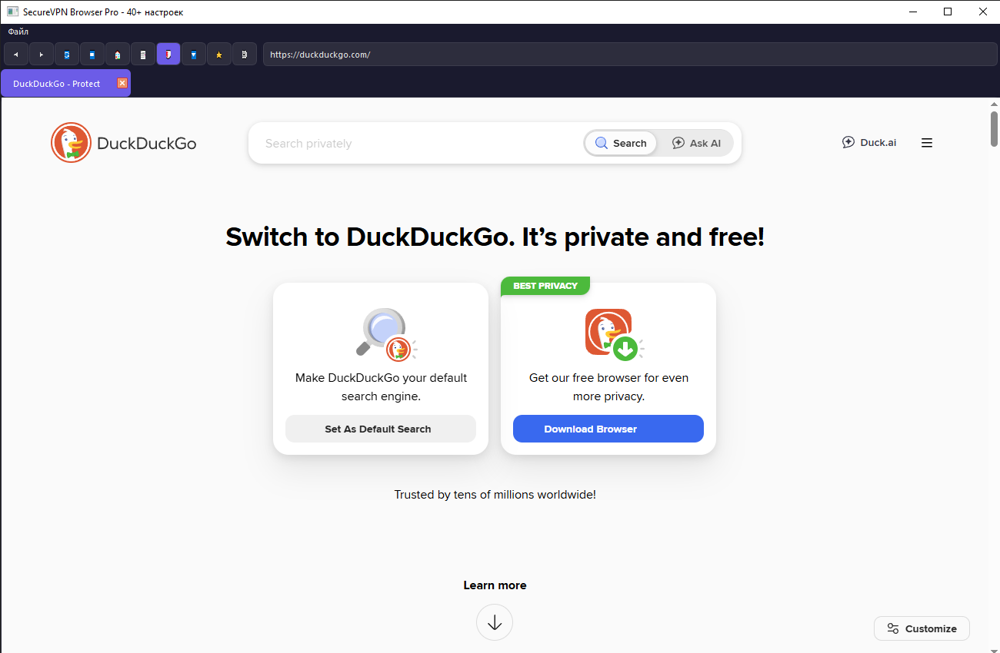

# 🔒 SecureVPN Browser Pro

**Современный веб-браузер на Python с поддержкой VPN, DoH, 40+ настройками и полным контролем конфиденциальности**

[](https://www.python.org/)
[](https://www.riverbankcomputing.com/software/pyqt/)
[](https://pyinstaller.org/)
[](LICENSE)
[]()



## 📦 Скачать

### Готовые сборки (Windows)
| Версия | Скачать | Размер |
|--------|---------|--------|
| **SecureVPN Browser Pro** | [⬇️ Скачать EXE](https://github.com/MRGenius255/Securebrowser/releases/latest) | ~85 MB |

> **Важно**: При первом запуске может потребоваться разрешение в брандмауэре Windows

## ✨ Особенности

### 🛡️ **Встроенный VPN/Прокси менеджер**
- Поддержка SOCKS4, SOCKS5, HTTP, HTTPS прокси
- Авторизация для прокси (логин/пароль)
- Быстрый выбор предустановленных серверов
- Постоянное подключение без сброса
- Восстановление VPN после перезапуска

### 🌐 **DNS over HTTPS (DoH)**
- Встроенная поддержка DoH для обхода блокировок
- Поддержка xbox-dns.ru, Cloudflare, Google, Quad9, OpenDNS
- Тестирование DoH серверов
- Очистка DNS кэша

### 🔍 **Проверка сети**
- Определение реального IP адреса
- Информация о геолокации (страна, город, координаты)
- Просмотр используемых DNS серверов
- Проверка разрешения доменов
- Информация о провайдере (ISP)

### ⚙️ **40+ настроек**
| Категория | Количество настроек |
|-----------|---------------------|
| Общие | 8 |
| Вкладки | 6 |
| Поиск | 5 |
| Внешний вид | 7 |
| Приватность | 8 |
| Сеть | 6 |
| Загрузки | 5 |
| Система | 6 |

### 🎨 **7 цветовых тем**
- 🌑 Тёмная (по умолчанию)
- ☀️ Светлая
- 💙 Синяя
- 💚 Зелёная
- 💜 Фиолетовая
- 🧡 Оранжевая
- 🩷 Розовая

### 📦 **Менеджер загрузок**
- Отслеживание прогресса загрузки
- Выбор папки сохранения
- Открытие папки с загрузками
- История загрузок

### 🔖 **Закладки и история**
- Сохранение закладок
- История посещений
- Менеджер паролей

### ⌨️ **Горячие клавиши**
| Комбинация | Действие |
|------------|----------|
| `Ctrl+T` | Новая вкладка |
| `Ctrl+W` | Закрыть вкладку |
| `Ctrl+,` | Открыть настройки |
| `Ctrl+Q` | Выход |

## 🚀 Установка из исходников

### Требования
- Python 3.10 или выше
- pip

### Установка зависимостей

```bash
pip install -r requirements.txt
